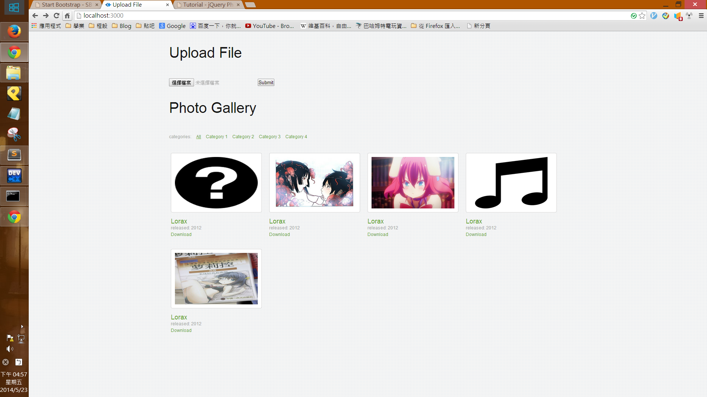
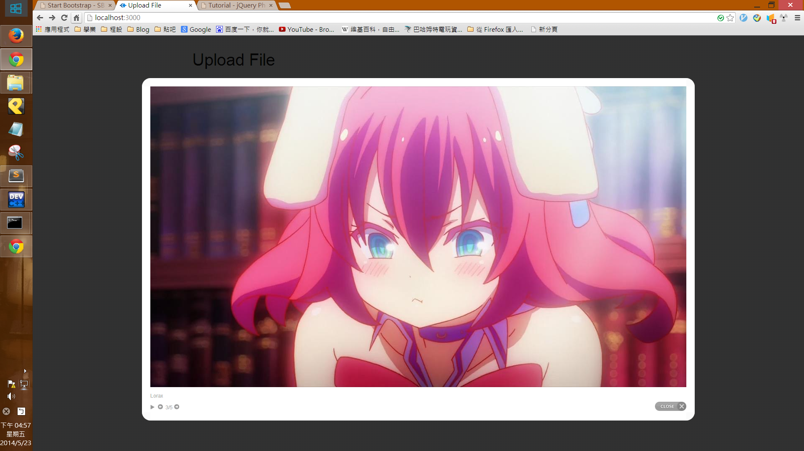

Simple upload server website
=====

base on nodejs, express.

## Function ##
* upload any file to server
* download any file to server
* view all file list on server

## Material ##
* nodejs
* express
* [jquery-photo-gallery](http://www.flashuser.net/jquery-photo-gallery)

## Install ##

  First,
  
    npm install
      
  Second,
  
    node server.js
    
## Other ##

